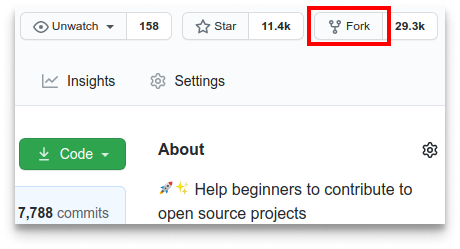

### Why Should I Contribute?
Hacktoberfest has a simple and plain moto.
> Support open source and earn a limited edition T-shirt and few stickers!

So, yes! You can win a T-Shirt and few awesome stickers to attach on your laptop. On plus side, you will get into beautiful world of open source and get the international exposure. 

***

### How To Contribute?

It's very easy. You don't need to be an expert in coding and programming.

If you know a course that will help the other developers please feel free to add it to the website. 

Here are the steps to follow : 

1. Fork this repository by click the Fork button in the top right of this page or just [click here](https://github.com/ishandeveloper/Coursify-hacktoberfest/fork). Feel free to leave a star, if you'd like 

    

1. Clone the forked repository on your desktop using

    ```    
    git clone https://github.com/<your-github-username>/Coursify-hacktoberfest
    ```
1. Change to the repository directory on your computer (if you are not already there):

    ```
    cd Coursify-hacktoberfest
    ```

1. Create & checkout into a new branch `<your-username>` using

    ```
    git checkout -b <your--github-username>
    ```

4. Open `courses/data.js` file in your preferred editor.

5. Append your course info in the `data` array by filling out the following JSON Template
    ```js
    {
      name:'Name of the course',
      instructor: 'Name of course instructor',
      url:'Link to the course',
      description:'A short summary about the course',
      image: '',
      tags:['Technology', 'Framework']
    }
    ```

1. **[Optional]**  You can also add your own custom hero image, by adding the image in `courses\images\` folder and replacing `''` in `image:''` with the name of your image file (including extension).

1. Add and commit your changes using

    ```bash
    git commit -am "ADDED : [COURSE NAME]"
    ```
1. Push the changes to your forked repository.

1. **Submit your changes for review**
    If you go to your forked repository on GitHub, you'll see a `Compare & pull request` button. Click on that button.

    

    * Now submit your pull request, by clicking the `Create Pull Request` button.

If the above guide was tough for you to follow, you can follow the instructions [here](https://www.digitalocean.com/community/tutorials/how-to-create-a-pull-request-on-github).

## That's it! 
#### You've succesfully created your first Pull Request and made your first contribution to the open source community!

I'll be merging your pull requests soon enough and you'll be able to see the changes live [here](http://ishandeveloper.com/Coursify-hacktoberfest/).

### Making Styling Changes

This project uses SASS/SCSS syntax for styling.

1. Make all styling changes inside of `assets/main.scss` - do not edit `assets/main.css` directly.
2. To see/save your changes, install SASS for the command line: `npm i -g sass`
3. Run the SASS compile command from the project root: `sass assets/main.scss assets/main.css`
4. Confirm your changes on the client and in `assets/main.css`
5. Commit all of the following files: `assets/main.scss`, `assets/main.css` and `assets/main.css.map`

### Contributors

[](https://sourcerer.io/fame/ishandeveloper/ishandeveloper/Coursify-hacktoberfest/links/0)[](https://sourcerer.io/fame/ishandeveloper/ishandeveloper/Coursify-hacktoberfest/links/1)[](https://sourcerer.io/fame/ishandeveloper/ishandeveloper/Coursify-hacktoberfest/links/2)[](https://sourcerer.io/fame/ishandeveloper/ishandeveloper/Coursify-hacktoberfest/links/3)[](https://sourcerer.io/fame/ishandeveloper/ishandeveloper/Coursify-hacktoberfest/links/4)[](https://sourcerer.io/fame/ishandeveloper/ishandeveloper/Coursify-hacktoberfest/links/5)[](https://sourcerer.io/fame/ishandeveloper/ishandeveloper/Coursify-hacktoberfest/links/6)[](https://sourcerer.io/fame/ishandeveloper/ishandeveloper/Coursify-hacktoberfest/links/7)
